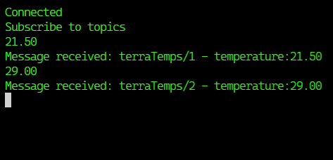

# Steps to get MQTT data to influxdb

## Setting up MQTT on AWS

I've followed these guides:

1. https://medium.com/@achildrenmile/mqtt-broker-on-aws-ec2-hands-on-install-configure-test-out-f12dd2f5c9d0
2. https://blog.yatis.io/install-secure-robust-mosquitto-mqtt-broker-aws-ubuntu/

## Example of output

